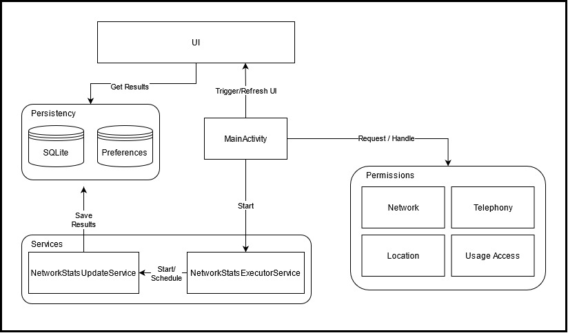
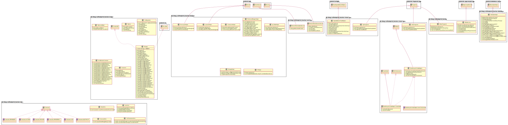

# CO2 Footprint Tracker

This project is being developed for the [OFAR4All](https://map.bodenseehochschule.org/proj.php?id=101&origin=map) research project, with the aim of measuring and transparently presenting CO2 emissions from online data traffic.

## About the application

The application tracks the users data usage and calculates the emitted CO2-values based on a computational model, which is currently under development by [ZHAW](https://www.zhaw.ch/de/hochschule/). In order to be able to classify consumption properly, CO2 equivalents are given that are familiar from everyday life.

The application is currently only available for **android devices**.

## Project structure
	co2footprint_tracker
	├── app
	│	└── src/main
	|		├── java/de/htwg/co2footprint_tracker
	|		|	├── database
	|		|	├── enums
	|		|	├── helpers
	|		|	├── model
	|		|	├── services
	|		|	└── utils
	|		└── res
	└── gradle/wrapper

| Folder                            | Description                                                  |
| --------------------------------- | ------------------------------------------------------------ |
| root                              | contains necessary parts for initializing and building the app |
| app                               | contains all necessary parts directly regarding the functionality of the app e.g. source code, build files |
| src/main                          | contains the main source code, viewing components and android manifest |
| java/de/htwg/co2footprint_tracker | contains only source code which belonges to logic and functionality of the app |
| database                          | contains source code that only belongs for managing databases |
| enums                             | contains source code for establishing own datatypes          |
| helpers                           | Contains source code for helper methods. These helper methods, in contrast to utils, also contain advanced logic and functionalities |
| model                             | Contains source code for data transfer objects between classes, databases, views etc. |
| services                          | Contains source code for services that are run in background and do tasks for fullfilling the main app goal |
| utils                             | Contains source code for simple helpers e.g. string converters, constants etc. |
| res                               | Contains resource files and static content used by the source code e.g. bitmaps, fonts, etc. |
| gradle/wrapper                    | Contains files for gradle                                    |

## Core Application Design

The image shows the core design of the application with the most important classes.

## Design decisions

The following is a list of relevant design decisions and their technical relevance to the app.

### NetworkStatsManager

For gathering the devices data usage and the generated network traffic, the application uses the NetworkStatsManager API provided by the operating system. Via the NetworkStatsManager it is possible to access all information in regards to the Network usage. The provided data is divided in discrete time periods (Buckets) which can overlap from time to time. More information on the NetworkStatsManager: https://developer.android.com/reference/android/app/usage/NetworkStatsManager

### SQLight-Database

For saving information and relevant data, the application uses a simple SQLight-Database. The database contains the information about the network traffic fetched from the NetworkStatsManager. These information are fetched periodically after every minute and saved in a table together with other calculated values. To save storage space, every 24h hours, the collected data of the last day gets accumulated and saved while the old data is being wiped.

### Foreground Service

To work correctly, the application must always be open in the background. This is ensured via a Foreground Service, which ensures that the app is not closed by the system (memory optimizer). If the app should be closed by the system or the user, it will restart itself.

### Location determination

To determine the current location of the user, the application uses the LocationHelper API provided by the operation system. The location is determined at the first installation of the App (onStart) and always when reopening it (onResume) and is then saved in the background for further calculations.

### Identifying Devicetype  (Smartphone and Tablet)

To identify which type of device is currently used, the application calculates the device-indepentent pixel density and checks, if the density of >= 600. If it is bigger, then the device is considered a tablet, if it's smaller the device is identified as a smartphone. For the values and the calculation see: https://developer.android.com/training/multiscreen/screensizes

### Google Cloud Config

With the help of the connection to the Google Cloud, configuration files and information can be provided online, which flows directly into the app without having to create a new build of the app. For example, tips can be adjusted directly via Google Cloud Config without having to deploy a new app version.

## App Permissions
The Application needs a couple of permissions in order to function properly.

**Network Permission:** This Permission is needed to access the internet to retrieve information from the Google Cloud Config (e.g. new Tips).

**Phone State Permission:** This Permission is needed to access the information for the current celluar network information. We use this information to determine which network type is currently used (2G, 3G, 4G, WiFi).

**Location Permission:** This Permission is needed to access the GPS Module to get the current location. The calulation of CO2 values needs the location for different factors.

**Usage Stats Permission:** This Permission is essential for accessing the network statistics of the device. This permissions allows the application to access the NetworkStatsManager API and gather the data usage of different apps.

**IMPORTANT NOTICE:** The application is not able to see which websites you have browsed or what you do exactly in your different applications. The Application only accesses the information, which are already collected by the operating system. Furthermore are all permissions needed and not abused in other ways.

## Class Diagramm

TODO: Add most recent Class Diagramm

